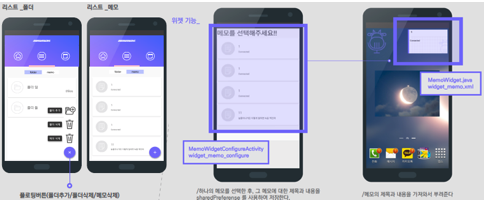

# Ummae




## 소개
`음성을 텍스트로 변환해 메모로 저장해주는 애플리케이션`입니다.

## 개발환경


## 팀 인원
* 개발 
  - [권현아](https://github.com/kwonhyeona)
  - [고민주](https://github.com/minju54)
  - [여인혜](https://www.instagram.com/y__ih123/?hl=ko)
* 디자인
  - [장윤정](http://notefolio.net/yoomm)
  
## 주요기능
* [Naverspeech-1.0.4.jar](https://github.com/naver/naverspeech-sdk-android/releases) 를 이용해 음성을 텍스트로 변환
* [Realm](https://realm.io/kr/) 를 이용해 메모 관리
* RecyclerView를 이용해 메모 리스트 제공
* 캘린더로 메모 현황 제공

## 맡은역할
- Realm 관련 데이터 제어 코드 작성
- RecyclerView 관련 코드 

## 주요코드
```java
/*
  Realm 이용해 메모를 관리한 코드입니다.
*/
public class Memo extends RealmObject {
     @PrimaryKey
     private int memoId;

     //외래키
     private int idOfFolder;

     private String memoName;
     private String memoContents;
     private String memoday;
     private String memoTime;
     @Ignore
     private boolean isSelected;
     
     // 생성자 리스트
     public Memo() {
     }
     
     ... 
     
     //getter, setter 메소드
     ...
}

public class MemoModel {
     Realm realm;

     // MemoModel 객체 생성될 때 Realm도 같이 인스턴스화 한다.
     public MemoModel() {
         realm = Realm.getDefaultInstance();
     }
     
     // 전체 개수 반환 메소드
     public int count() {
         return (int) realm.where(Memo.class).count();
     }
     
     // primary key인 id에 해당하는 Memo 객체를 반환한다.
     public Memo getMemoById(int memoId) {
         //Realm 내의 Memo 데이터 중 해당 id의 데이터만을 가져오기
         return realm.where(Memo.class).equalTo("memoId", memoId).findFirst();
     }
     
     // Realm 내의 Memo 데이터 중 하나를 Update한다.
     public void editMemo(Memo memo) {
        realm.beginTransaction();

        //realm 이 변경되는 코드
        realm.copyToRealmOrUpdate(memo);
        realm.commitTransaction();
    }
    
    // Memo 객체를 전달받아 copyToRealm 메소드 이용해서 Realm에 저장한다.
    public void addMemo(Memo memo) {
        //Realm 에 Memo 데이터를 삽입
        realm.beginTransaction();
        realm.copyToRealm(memo);
        realm.commitTransaction();
    }
    
    //id에 해당하는 Memo 데이터를 삭제한다.
    public void deleteMemo(int memoId) {
        realm.beginTransaction();

        if(realm.where(Memo.class).equalTo("memoId", memoId).findFirst().isValid())
            realm.where(Memo.class).equalTo("memoId", memoId).findFirst().removeFromRealm();

        realm.commitTransaction();
    }

     // Realm에 저장된 모든 메모 데이터들을 AraayList<Memo> 객체로 반환한다.
     public ArrayList<Memo> getAllMemos() {
         RealmResults<Memo> realmResults = realm.where(Memo.class).findAll();

         ArrayList<Memo> memoList = new ArrayList<>();
         for (Memo memo : realmResults) {
             memoList.add(memo);
         }

         return memoList;
     }
     
     //날짜에 대한 Memo 데이터들을 AraayList<Memo> 객체로 반환한다.
     public ArrayList<Memo> getDateOfMemos(String curCalendarDate) {
         RealmResults<Memo> realmResults = realm.where(Memo.class).equalTo("memoday", curCalendarDate).findAll();

         ArrayList<Memo> memoList = new ArrayList<>();
         for (Memo memo : realmResults) {
             memoList.add(memo);
         }

         return memoList;
     }
     
     // 같은 폴더에 있는 Memo 데이터들을 AraayList<Memo> 객체로 반환한다.
     public ArrayList<Memo> getMemosInSameFolder(int folderId) {
        RealmResults<Memo> memos = realm.where(Memo.class).equalTo("idOfFolder", folderId).findAll();

        ArrayList<Memo> memoList = new ArrayList<>();
        for (Memo memo : memos) {
            memoList.add(memo);
        }

        return memoList;
    }
    
    //Realm에서는 id를 AutoIncrement로 생성해주지 않아서 직접 정해주어야 한다.
    //Realm에 저장된 Memo 데이터 중 가장 나중에 생성된 데이터의 id 값에 +1하는 방식으로 id를 생성한다.
    public int getNewId() {
        int newId = 0;
        RealmResults<Memo> realmResults = realm.where(Memo.class).findAll();

        //Realm에 데이터가 하나도 없으면 realmResults에 데이터가 없어
        //realmResults 가 0보다 큰 경우에만 id생성, 작은 경우에는 0반환
        if (realmResults.size() > 0) {
            newId = realmResults.last().getMemoId() + 1;
        }
        return newId;
    }
    
    // MemoModel에서 인스턴스화했던 Realm 객체를 메모리에서 해제한다.
    public void closeRealm() {
        realm.close();
    }
}
```
